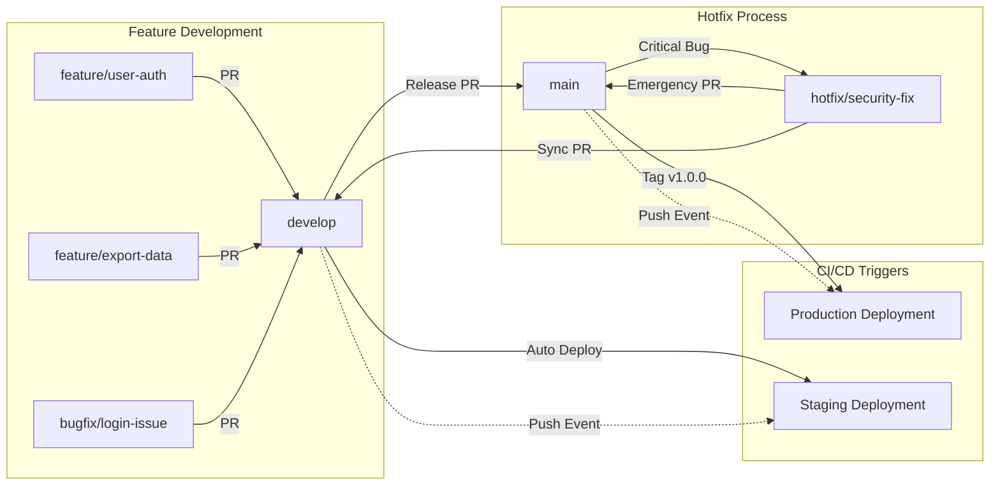

# Git Branching Strategy

## Introduction

This document defines the Git branching strategy for the **DrFirst Agentic Business Case Generator** project. This strategy is designed to support collaborative development, maintain code quality, and integrate seamlessly with our automated CI/CD pipelines.

The strategy follows a **GitHub Flow with Staging Branch** approach, which provides a balance between simplicity and robustness suitable for our team size and project complexity.

## Main Branches

### `main` Branch
- **Purpose**: Represents production-ready code that is stable and tested
- **Protection**: Direct commits are **strictly prohibited**
- **Source**: Receives merges only from `develop` branch via Pull Requests
- **CI/CD Integration**: Pushes to `main` will trigger deployment to the **production environment**
- **Tagging**: All releases are tagged with semantic versioning (e.g., `v1.0.0`, `v1.1.0`)
- **Quality Gate**: Must pass all CI checks and require thorough code review

### `develop` Branch
- **Purpose**: Integration branch representing the next upcoming release and current staging state
- **Protection**: Direct commits are **discouraged**; all changes should come via Pull Requests
- **Source**: Receives merges from feature and bugfix branches
- **CI/CD Integration**: Pushes to `develop` automatically trigger deployment to the **staging/dev environment**
- **Quality Gate**: Must pass all CI checks before deployment

## Supporting Branches

### Feature Branches
- **Naming Convention**: 
  - `feature/feature-name` (e.g., `feature/user-authentication`)
  - `feat/JIRA-123-short-description` (e.g., `feat/BC-456-export-functionality`)
- **Source**: Always branched from `develop`
- **Purpose**: Develop new features or significant enhancements in isolation
- **Lifecycle**: 
  1. Branch from `develop`
  2. Develop feature with regular commits
  3. Create Pull Request to merge back into `develop`
  4. Delete branch after successful merge
- **Merging**: Merged into `develop` via Pull Request only

### Bugfix Branches
- **Naming Convention**:
  - `bugfix/issue-description` (e.g., `bugfix/login-validation-error`)
  - `fix/JIRA-456-bug-description` (e.g., `fix/BC-789-pdf-generation-crash`)
- **Source**: Typically branched from `develop` for bugs found in staging
- **Purpose**: Fix non-critical bugs discovered during development or testing
- **Merging**: Merged into `develop` via Pull Request

### Hotfix Branches
- **Naming Convention**: 
  - `hotfix/critical-issue` (e.g., `hotfix/security-vulnerability`)
  - `hotfix/JIRA-999-critical-description`
- **Source**: Branched from `main` for critical production issues
- **Purpose**: Address urgent production bugs that cannot wait for the next release cycle
- **Merging**: 
  1. Merged into `main` via Pull Request (for immediate production fix)
  2. Merged into `develop` via Pull Request (to incorporate fix in ongoing development)
- **Deployment**: Triggers immediate production deployment after merge to `main`

## Workflow Diagram



## Pull Request Process

### Requirements for All Pull Requests
1. **Mandatory Reviewers**: At least one team member approval required
2. **CI/CD Checks**: All automated checks must pass:
   - Backend linting and tests
   - Frontend linting and tests  
   - Build verification
   - Security scans
3. **Branch Protection**: Target branches (`main`, `develop`) are protected
4. **Merge Strategy**: Squash commits to maintain clean history

### PR Creation Guidelines
- **Title**: Clear, descriptive title explaining the change
- **Description**: 
  - Link to related issues/tickets
  - Summary of changes made
  - Testing performed
  - Any breaking changes or migration notes
- **Labels**: Apply appropriate labels (feature, bugfix, hotfix, etc.)

### Review Process
1. **Self-Review**: Author performs self-review before requesting review
2. **Peer Review**: At least one team member reviews code quality, logic, and adherence to standards
3. **Testing**: Reviewer verifies that appropriate tests are included
4. **Documentation**: Ensure any necessary documentation updates are included

## CI/CD Integration

### Staging Environment (`develop` branch)
- **Trigger**: Any push or merge to `develop` branch
- **Deployment**: Automatic deployment to staging environment
- **Purpose**: Integration testing, stakeholder review, QA validation
- **Rollback**: Can be rolled back to previous `develop` commit if issues arise

### Production Environment (`main` branch)
- **Trigger**: Any push or merge to `main` branch
- **Deployment**: Automatic deployment to production environment
- **Purpose**: Live user-facing application
- **Rollback**: Critical - requires immediate hotfix if issues occur

### CI Checks (Applied to All PRs)
- **Backend**: Linting (flake8, black), unit tests, integration tests
- **Frontend**: ESLint, TypeScript compilation, unit tests, build verification
- **Security**: Dependency vulnerability scanning
- **Build**: Successful Docker image creation

## Tagging Strategy

### Semantic Versioning
- **Format**: `vMAJOR.MINOR.PATCH` (e.g., `v1.2.3`)
- **MAJOR**: Breaking changes or significant new features
- **MINOR**: New features, backward compatible
- **PATCH**: Bug fixes, backward compatible

### Tagging Process
1. When merging `develop` to `main` for a release
2. Create annotated tag with release notes:
   ```bash
   git tag -a v1.2.0 -m "Release v1.2.0: Added export functionality and user authentication"
   ```
3. Push tag to trigger production deployment:
   ```bash
   git push origin v1.2.0
   ```

## Branch Naming Conventions Summary

| Branch Type | Naming Pattern | Example |
|-------------|----------------|---------|
| Feature | `feature/description` | `feature/user-dashboard` |
| Feature (with ticket) | `feat/TICKET-description` | `feat/BC-123-export-pdf` |
| Bugfix | `bugfix/description` | `bugfix/login-timeout` |
| Bugfix (with ticket) | `fix/TICKET-description` | `fix/BC-456-chart-rendering` |
| Hotfix | `hotfix/description` | `hotfix/security-patch` |

## Best Practices

### For Developers
1. **Sync Regularly**: Pull latest changes from `develop` before starting new work
2. **Small PRs**: Keep Pull Requests focused and reasonably sized
3. **Clear Commits**: Write descriptive commit messages
4. **Test Locally**: Ensure all tests pass locally before creating PR
5. **Clean Up**: Delete feature branches after successful merge

### For Reviewers
1. **Timely Reviews**: Respond to PR requests within 24 hours
2. **Constructive Feedback**: Provide specific, actionable feedback
3. **Test Verification**: Verify that appropriate tests cover the changes
4. **Documentation Check**: Ensure documentation is updated if needed

### For Release Management
1. **Release Planning**: Coordinate releases through `develop` → `main` PRs
2. **Environment Parity**: Ensure staging accurately reflects production
3. **Rollback Planning**: Have rollback procedures documented and tested
4. **Communication**: Notify team of releases and any breaking changes

## Emergency Procedures

### Production Hotfix Process
1. **Assess Impact**: Determine if issue requires immediate hotfix
2. **Create Hotfix Branch**: Branch from `main` with descriptive name
3. **Develop Fix**: Implement minimal fix to address the issue
4. **Test Thoroughly**: Test fix in isolated environment if possible
5. **Emergency PR**: Create PR to `main` with expedited review
6. **Deploy**: Merge triggers automatic production deployment
7. **Sync to Develop**: Create PR to merge hotfix into `develop`

### Rollback Procedures
1. **Immediate**: Revert commit on `main` if possible
2. **Alternative**: Deploy previous stable tag
3. **Communication**: Notify team and stakeholders immediately
4. **Post-Mortem**: Conduct review to prevent similar issues

## Conclusion

This branching strategy provides a robust framework for collaborative development while maintaining code quality and enabling continuous deployment. All team members should familiarize themselves with these guidelines and follow them consistently to ensure smooth project operations.

For questions or suggestions regarding this strategy, please discuss with the development team and update this document as needed. 