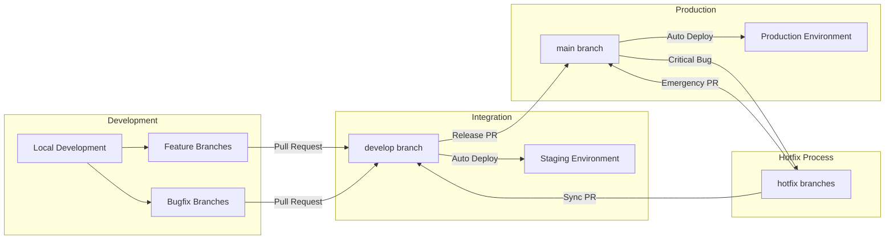

# CI/CD Pipeline Documentation

**Project:** DrFirst Agentic Business Case Generator  
**Version:** 1.0.0  
**Last Updated:** January 2025

---

## Table of Contents

1. [Introduction](#introduction)
2. [Overall CI/CD Strategy & Environment Promotion](#overall-cicd-strategy--environment-promotion)
3. [Workflow Files Overview](#workflow-files-overview)
4. [Detailed Workflow Breakdown](#detailed-workflow-breakdown)
5. [Environment Configuration & Secrets Management](#environment-configuration--secrets-management)
6. [Pull Request Checks](#pull-request-checks)
7. [Monitoring Pipeline Status](#monitoring-pipeline-status)
8. [Troubleshooting Common CI/CD Issues](#troubleshooting-common-cicd-issues)
9. [Future Considerations](#future-considerations)

---

## Introduction

### Purpose of the CI/CD Pipelines

The DrFirst Agentic Business Case Generator employs a comprehensive CI/CD (Continuous Integration/Continuous Deployment) pipeline to ensure:

- **Code Quality**: Automated linting, testing, and security scanning
- **Consistent Deployments**: Standardized deployment processes across environments
- **Rapid Feedback**: Quick identification of issues through automated checks
- **Environment Parity**: Consistent configurations between staging and production
- **Security**: Secure handling of secrets and credentials

### Technologies Used

Our CI/CD pipeline leverages the following technologies:

- **GitHub Actions**: Primary CI/CD orchestration platform
- **Docker**: Containerization for consistent environments
- **Google Artifact Registry (GAR)**: Container image storage
- **Google Cloud Run**: Backend deployment platform
- **Firebase Hosting**: Frontend hosting platform
- **Firebase CLI**: Database rules and configuration deployment
- **Google Secret Manager**: Secure credential storage
- **Workload Identity Federation**: Secure GCP authentication
- **Trivy**: Container security scanning

### Related Documentation

This document is closely related to our [Branching Strategy](./BRANCHING_STRATEGY.md), which defines how code flows through our development process. Please review that document for understanding branch policies and workflow.

---

## Overall CI/CD Strategy & Environment Promotion

### Environment Flow

Our CI/CD strategy follows a **GitHub Flow with Staging Branch** approach:



### Deployment Triggers

| Branch | Environment | Deployment Target | Trigger |
|--------|------------|------------------|---------|
| `develop` | **Staging** | Firebase Hosting (develop channel) + Cloud Run (dev service) | Push to develop |
| `main` | **Production** | Firebase Hosting (live channel) + Cloud Run (prod service) | Push to main |
| Feature/Bugfix | **None** | CI checks only | Pull Request |
| `hotfix/*` | **Production** | Immediate deployment via main | Emergency PR merge |

### Environment Promotion Strategy

1. **Feature Development**: Code changes start in feature branches
2. **Integration Testing**: Features merge to `develop` → automatic staging deployment
3. **Stakeholder Review**: Testing and validation on staging environment
4. **Production Release**: `develop` merges to `main` → automatic production deployment
5. **Hotfix Path**: Critical issues bypass staging via hotfix branches

---

## Workflow Files Overview

Our CI/CD pipeline consists of four main workflow files:

| Workflow File | Primary Responsibility | Triggers |
|---------------|----------------------|----------|
| **`backend-ci.yml`** | Backend testing, building, and deployment to Cloud Run | Push/PR to main/develop |
| **`frontend-ci-cd.yml`** | Frontend testing, building, and deployment to Firebase Hosting | Push/PR to main/develop |
| **`firestore-deploy.yml`** | Firestore rules and indexes deployment | Push to main/develop (when database files change) |
| **`frontend-ci.yml`** | Legacy frontend CI (minimal) | Various branches |

---

## Detailed Workflow Breakdown

### Backend CI/CD (`backend-ci.yml`)

#### Triggers
```yaml
on:
  push:
    branches: [main, develop]
  pull_request:
    branches: [main, develop]
```

#### Jobs Overview

##### 1. `build-and-test` Job
**Purpose**: Code quality assurance, testing, and container image creation

**Key Steps**:
1. **Checkout & Setup**
   - `actions/checkout@v4`: Get source code
   - `actions/setup-python@v5`: Install Python 3.11
   - `actions/cache@v4`: Cache Python dependencies

2. **Code Quality**
   - Install dependencies from `requirements.txt`
   - **Lint**: Run `flake8` with project-specific configuration
   - **Test**: Execute `pytest` with coverage reporting

3. **Container Building**
   - `docker/setup-buildx-action@v3`: Configure Docker BuildKit
   - `docker/build-push-action@v5`: Build Docker image
   - **Cache Strategy**: GitHub Actions cache for faster builds

4. **Cloud Deployment** (Push to main/develop only)
   - **Authentication**: `google-github-actions/auth@v2` with Workload Identity
   - **Image Tagging**: Branch-specific and SHA-based tags
   - **Push to GAR**: Store in Google Artifact Registry
   - **Security Scan**: Trivy vulnerability scanning
   - **SARIF Upload**: Security results to GitHub Security tab

**Key Actions Used**:
- `actions/checkout@v4`
- `actions/setup-python@v5`
- `docker/build-push-action@v5`
- `google-github-actions/auth@v2`
- `aquasecurity/trivy-action@master`

##### 2. `verify-image` Job
**Purpose**: Post-deployment verification

**Key Steps**:
1. Authenticate to GCP
2. Pull deployed image from Artifact Registry
3. Basic container health check
4. Verify service startup

#### Environment Variables
- `GAR_REGION`: `us-central1`
- `GAR_PROJECT_ID`: `drfirst-business-case-gen`
- `GAR_REPOSITORY`: `drfirst-backend`
- `IMAGE_NAME`: `drfirst-backend`

### Frontend CI/CD (`frontend-ci-cd.yml`)

#### Triggers
```yaml
on:
  push:
    branches: [main, develop]
  pull_request:
    branches: [main, develop]
```

#### Jobs Overview

##### 1. `build-test-deploy` Job
**Purpose**: Frontend building, testing, and deployment to Firebase Hosting

**Key Steps**:
1. **Environment Setup**
   - `actions/checkout@v4`: Get source code
   - `actions/setup-node@v4`: Install Node.js 18.x with npm cache

2. **Code Quality**
   - `npm ci`: Install dependencies
   - `npm run lint:prod`: ESLint with production settings
   - `npm test`: Run unit tests

3. **Environment Configuration**
   - **Develop Branch**: Copy `.env.staging` to `.env`
   - **Main Branch**: Copy `.env.production` to `.env`
   - **PRs/Other**: Copy `.env.development` to `.env`

4. **Build & Deploy**
   - `npm run build`: Create production build
   - `actions/upload-artifact@v4`: Archive build artifacts
   - **Firebase Deploy**: `FirebaseExtended/action-hosting-deploy@v0`
     - Develop → `develop` channel (staging)
     - Main → `live` channel (production, commented out for now)

##### 2. `notify` Job
**Purpose**: Workflow status notifications

**Key Steps**:
1. Determine overall workflow status
2. Set environment-specific information
3. Generate comprehensive status report
4. Future: Slack/email notifications

**Key Actions Used**:
- `actions/checkout@v4`
- `actions/setup-node@v4`
- `FirebaseExtended/action-hosting-deploy@v0`

### Firestore Deployment (`firestore-deploy.yml`)

#### Triggers
```yaml
on:
  push:
    branches: [main, develop]
    paths:
      - 'firestore.rules'
      - 'firestore.indexes.json'
```

**Note**: Only triggers when database configuration files change.

#### Jobs Overview

##### 1. `deploy-firestore-config` Job
**Purpose**: Deploy database rules and indexes

**Key Steps**:
1. **Setup**
   - `actions/checkout@v4`: Get source code
   - `actions/setup-node@v4`: Install Node.js 20.x
   - Install Firebase CLI globally

2. **Authentication**
   - `FirebaseExtended/action-hosting-deploy@v0`: Firebase authentication

3. **Deployment**
   - Deploy Firestore security rules
   - Deploy Firestore indexes (TODO: implementation pending)
   - Verification steps (TODO: implementation pending)

##### 2. `notify` Job
**Purpose**: Deployment status notifications

**Key Actions Used**:
- `actions/checkout@v4`
- `actions/setup-node@v4`
- `FirebaseExtended/action-hosting-deploy@v0`

---

## Environment Configuration & Secrets Management

### Environment Variable Strategy

Our application uses different strategies for frontend and backend environment variables:

#### Frontend Variables (Build-time)
- **Prefix**: All variables must start with `VITE_`
- **Deployment**: Embedded into JavaScript bundle during build
- **Environment-specific**: Different `.env` files for each environment
  - `.env.development` - Local development and PR builds
  - `.env.staging` - Staging environment (develop branch)
  - `.env.production` - Production environment (main branch)

#### Backend Variables (Runtime)
- **Non-sensitive**: Set directly in Cloud Run environment variables
- **Sensitive**: Stored in Google Secret Manager and accessed via Workload Identity Federation

### GitHub Secrets Configuration

The following secrets must be configured in the GitHub repository settings:

| Secret Name | Purpose | Used By |
|-------------|---------|---------|
| `GCP_WORKLOAD_IDENTITY_PROVIDER` | GCP Workload Identity pool provider | Backend, Firestore workflows |
| `GCP_SERVICE_ACCOUNT_EMAIL` | Service account for GCP authentication | Backend, Firestore workflows |
| `FIREBASE_SERVICE_ACCOUNT_KEY_JSON` | Firebase service account credentials | Frontend, Firestore workflows |
| `FIREBASE_PROJECT_ID_CONFIG` | Firebase project identifier | Frontend, Firestore workflows |

### Secret Manager Integration

Backend secrets are managed through Google Secret Manager:

```bash
# Example secrets stored in Secret Manager
app-secret-key              # JWT signing key
firebase-api-key            # Firebase server API key
```

Cloud Run services access these secrets via:
```yaml
--set-secrets="SECRET_KEY=app-secret-key:latest,FIREBASE_API_KEY=firebase-api-key:latest"
```

For detailed environment configuration, see [Environment Setup Guide](./ENVIRONMENT_SETUP.md).

---

## Pull Request Checks

### Required Status Checks

All Pull Requests targeting `main` or `develop` branches must pass the following checks:

#### Backend Checks
- ✅ **Linting**: `flake8` code style compliance
- ✅ **Testing**: `pytest` unit tests with coverage
- ✅ **Build**: Docker image successful creation
- ✅ **Security**: Trivy vulnerability scanning (for pushes)

#### Frontend Checks
- ✅ **Linting**: ESLint with production configuration
- ✅ **Testing**: Unit tests execution
- ✅ **Build**: Vite production build success
- ✅ **Type Checking**: TypeScript compilation

#### Firestore Checks
- ✅ **Rules Deployment**: Firestore rules validation
- ✅ **CLI Installation**: Firebase CLI setup

### Branch Protection Rules

Based on our [Branching Strategy](./BRANCHING_STRATEGY.md):

- **Direct pushes prohibited** to `main` and `develop`
- **At least one reviewer required** for all PRs
- **All status checks must pass** before merge
- **Squash merge strategy** to maintain clean history

---

## Monitoring Pipeline Status

### GitHub Actions Interface

1. **Repository Actions Tab**: `https://github.com/your-org/drfirst-business-case-generator/actions`
2. **Workflow Runs**: View all pipeline executions with status indicators
3. **Detailed Logs**: Click on individual jobs to view step-by-step execution
4. **Artifact Downloads**: Access build artifacts from workflow runs

### Workflow Notifications

#### Built-in Notifications
- **GitHub**: Email notifications for workflow failures (if enabled in user settings)
- **Status Badges**: Workflow status displayed in repository README
- **Pull Request Checks**: Status indicators directly in PR interface

#### Custom Notifications
Each workflow includes a notification job that outputs:
- 🔔 Workflow status (success/failure)
- 🌿 Branch information
- 📝 Commit details
- 🎯 Deployment information
- 🔗 Links to workflow runs

**Future Enhancement**: Slack integration ready for implementation:
```yaml
# Example Slack notification (commented in workflows)
- name: Send Slack notification
  uses: rtCamp/action-slack-notify@v2
  env:
    SLACK_WEBHOOK: ${{ secrets.SLACK_WEBHOOK_URL }}
    SLACK_MESSAGE: 'Workflow status notification'
```

### Deployment Monitoring

#### Backend (Cloud Run)
- **Cloud Console**: Monitor service health and logs
- **URL**: https://console.cloud.google.com/run?project=drfirst-business-case-gen
- **Health Endpoint**: Backend services should implement `/health` endpoints

#### Frontend (Firebase Hosting)
- **Firebase Console**: Monitor hosting status and analytics
- **URL**: https://console.firebase.google.com/project/drfirst-business-case-gen/hosting

---

## Troubleshooting Common CI/CD Issues

### Backend Issues

#### Test Failures
**Symptoms**: `pytest` step fails
**Common Causes**:
- Missing test dependencies
- Environment variable configuration
- Database connectivity issues

**Troubleshooting**:
1. Check test logs in GitHub Actions
2. Verify `requirements.txt` includes test dependencies
3. Ensure test environment variables are set correctly
4. Run tests locally with same configuration

#### Lint Errors
**Symptoms**: `flake8` step fails
**Common Causes**:
- Code style violations
- Import statement ordering
- Line length exceeding limits

**Troubleshooting**:
1. Run `flake8 --config=backend/.flake8 backend/app backend/tests` locally
2. Use IDE with flake8 integration
3. Apply automated fixes where possible

#### Build Errors
**Symptoms**: Docker build fails
**Common Causes**:
- Missing dependencies in Dockerfile
- Platform compatibility issues
- Cache corruption

**Troubleshooting**:
1. Check Docker build logs
2. Test build locally: `docker build -f backend/Dockerfile backend/`
3. Clear GitHub Actions cache if needed

#### Deployment Permission Issues
**Symptoms**: GCP authentication or resource access failures
**Common Causes**:
- Workload Identity misconfiguration
- Insufficient IAM permissions
- Expired credentials

**Troubleshooting**:
1. Verify GitHub secrets are correctly set
2. Check Workload Identity pool configuration
3. Ensure service account has required roles

### Frontend Issues

#### Build Errors
**Symptoms**: `npm run build` fails
**Common Causes**:
- TypeScript compilation errors
- Missing environment variables
- Dependency version conflicts

**Troubleshooting**:
1. Check build logs for specific errors
2. Verify all `VITE_*` variables are set
3. Run `npm run build` locally
4. Update or lock dependency versions

#### Environment Variable Issues
**Symptoms**: Runtime errors in deployed frontend
**Common Causes**:
- Missing `VITE_` prefix
- Incorrect environment file selection
- Build-time vs runtime configuration confusion

**Troubleshooting**:
1. Verify environment variables have `VITE_` prefix
2. Check correct `.env` file is used for branch
3. Inspect built JavaScript for embedded variables

#### Firebase Deployment Failures
**Symptoms**: Firebase hosting deployment fails
**Common Causes**:
- Invalid Firebase project configuration
- Authentication issues
- Build artifact not found

**Troubleshooting**:
1. Verify `FIREBASE_PROJECT_ID_CONFIG` secret
2. Check Firebase service account permissions
3. Ensure build step completed successfully

### General Issues

#### Workflow Not Triggering
**Symptoms**: Push to branch doesn't trigger workflow
**Common Causes**:
- Branch name doesn't match trigger patterns
- Workflow file syntax errors
- Path filters excluding changes

**Troubleshooting**:
1. Check workflow file YAML syntax
2. Verify branch name matches trigger configuration
3. Review path filters for relevant changes

#### Secrets Access Issues
**Symptoms**: Secret values are empty or undefined
**Common Causes**:
- Secret not configured in repository settings
- Incorrect secret name reference
- Missing permissions

**Troubleshooting**:
1. Verify secret exists in repository settings
2. Check exact secret name spelling
3. Ensure workflow has necessary permissions

### Where to Look for Logs

1. **GitHub Actions Logs**: Primary source for CI/CD issues
   - Navigate to Actions tab → Select workflow run → Click on failed job
   - Expand failed steps to see detailed output

2. **Cloud Run Logs**: For runtime issues
   - Cloud Console → Cloud Run → Select service → Logs tab
   - Use log filtering for specific error types

3. **Firebase Console**: For frontend deployment issues
   - Firebase Console → Hosting → View deployment history
   - Check deployment logs and status

---

## Future Considerations

### Planned Production Deployment

The current CI/CD setup targets development/staging environments. Production deployment from the `main` branch will follow a similar pattern but target production resources:

#### Backend Production
- **Service Name**: `drfirst-backend-prod`
- **Environment Variables**: Production-specific values
- **Secrets**: Production Secret Manager secrets
- **Authentication**: Production service account

#### Frontend Production
- **Firebase Channel**: `live` (currently commented out)
- **Environment Variables**: Production API URLs and configuration
- **Build Process**: Production optimizations enabled

### Enhancements Under Consideration

1. **Advanced Notifications**
   - Slack integration for team alerts
   - Email notifications for deployment status
   - Custom webhook notifications

2. **Enhanced Security**
   - Dependency vulnerability scanning
   - SAST (Static Application Security Testing)
   - Container image signing

3. **Performance Optimization**
   - Build cache optimization
   - Parallel job execution
   - Resource usage monitoring

4. **Testing Improvements**
   - Integration test environments
   - E2E testing in CI pipeline
   - Performance testing automation

5. **Monitoring & Observability**
   - Application performance monitoring
   - Log aggregation and alerting
   - Deployment rollback automation

---

## Conclusion

This CI/CD pipeline provides a robust foundation for the DrFirst Agentic Business Case Generator project, ensuring code quality, security, and reliable deployments. The automated processes reduce manual errors and enable rapid, confident releases.

For questions or suggestions regarding this CI/CD setup, please:
1. Review the relevant workflow files in `.github/workflows/`
2. Check the [Branching Strategy](./BRANCHING_STRATEGY.md) for workflow context
3. Consult the [Environment Setup Guide](./ENVIRONMENT_SETUP.md) for configuration details
4. Reach out to the development team for clarification

Regular review and updates of this documentation ensure it remains current with pipeline evolution and project needs. 