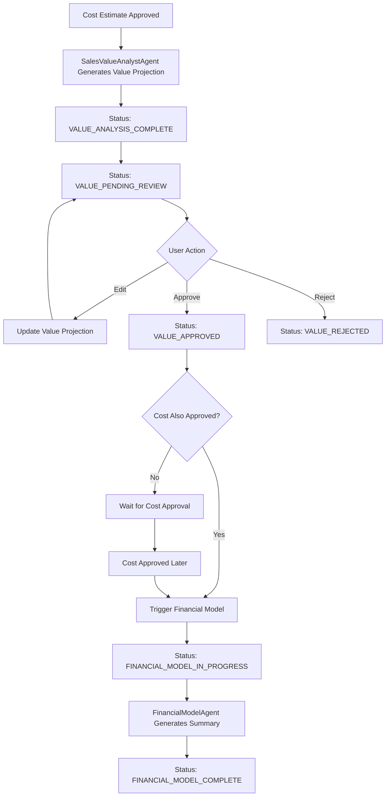

# Value Projection HITL Implementation Summary

**Task ID**: WF-FIX-VALUE-HITL  
**Date**: January 2025  
**Implementation Status**: ✅ Complete  

## Overview

This implementation completes the Human-in-the-Loop (HITL) workflow for Value Projection analysis in the DrFirst Agentic Business Case Generator. The system now provides a complete workflow from Cost Estimation approval through Value Projection review to Financial Model generation.

## Key Features Implemented

### 🔄 Complete Status Flow
- `VALUE_ANALYSIS_COMPLETE` → `VALUE_PENDING_REVIEW` → `VALUE_APPROVED` → `FINANCIAL_MODEL_IN_PROGRESS` → `FINANCIAL_MODEL_COMPLETE`

### 🔐 Authorization & Security
- Centralized approval permissions with Admin override
- Configurable "ValueProjection" approver roles
- Status-based access controls

### ⚡ Smart Workflow Orchestration
- Financial Model generation only triggers when both Cost and Value are approved
- Robust error handling and status recovery
- Comprehensive audit logging

### 🎨 User Interface
- Intuitive value projection display and editing
- Real-time status indicators
- Approval/rejection workflows with optional reasoning

## Backend Implementation

### 1. OrchestratorAgent Enhancements

#### New Method: `handle_value_approval()`
```python
async def handle_value_approval(self, case_id: str) -> Dict[str, Any]
```

**Functionality**:
- ✅ Verifies case status is `VALUE_APPROVED`
- ✅ Checks if Cost Estimate is also approved via history
- ✅ Triggers Financial Model generation when both are approved
- ✅ Handles "waiting for cost approval" scenario
- ✅ Comprehensive error handling and logging

**Decision Logic**:
```
If Value Approved AND Cost Approved:
  → Trigger Financial Model Generation
  → Set status to FINANCIAL_MODEL_COMPLETE

If Value Approved BUT Cost NOT Approved:
  → Wait for cost approval
  → Return success with waiting message
```

### 2. API Routes Updates

#### Fixed Value Projection Routes
**File**: `backend/app/api/v1/cases/financial_estimates_routes.py`

- ✅ **Status Check Fix**: Routes now check for `VALUE_PENDING_REVIEW` instead of `VALUE_ANALYSIS_COMPLETE`
- ✅ **Approve Route**: Updated to call `handle_value_approval()` for proper orchestration
- ✅ **Update Route**: Added optional `PUT /cases/{case_id}/value-projection` for editing

#### API Endpoints
| Method | Endpoint | Purpose | Status Required |
|--------|----------|---------|-----------------|
| `PUT` | `/cases/{case_id}/value-projection` | Update value projection | `VALUE_PENDING_REVIEW` |
| `POST` | `/cases/{case_id}/value-projection/approve` | Approve value projection | `VALUE_PENDING_REVIEW` |
| `POST` | `/cases/{case_id}/value-projection/reject` | Reject value projection | `VALUE_PENDING_REVIEW` |

### 3. Data Models
**File**: `backend/app/api/v1/cases/models.py`

- ✅ `ValueProjectionUpdateRequest`: For editing value projections
- ✅ `ValueProjectionRejectRequest`: For rejection with optional reason
- ✅ Comprehensive validation for scenarios, currency, assumptions

## Frontend Implementation

### 1. Status Management Updates

#### ValueAnalysisSection Component
**File**: `frontend/src/components/specific/ValueAnalysisSection.tsx`

**Changes**:
- ✅ Updated `canApproveRejectValueProjection()` to check `VALUE_PENDING_REVIEW`
- ✅ Added status chip for `VALUE_PENDING_REVIEW`
- ✅ Fixed approval button visibility logic

```typescript
const canApproveRejectValueProjection = () => {
  return status === 'VALUE_PENDING_REVIEW' && value_projection_v1;
};
```

### 2. Business Case Detail Page
**File**: `frontend/src/pages/BusinessCaseDetailPage.tsx`

**Existing Features Verified**:
- ✅ Value projection display with scenarios, methodology, assumptions
- ✅ Editing functionality for authorized users
- ✅ Approve/reject buttons with proper permissions
- ✅ Status-based UI controls
- ✅ Error handling and success messages

### 3. Agent Service Integration
**Files**: 
- `frontend/src/services/agent/AgentService.ts`
- `frontend/src/services/agent/HttpAgentAdapter.ts`
- `frontend/src/contexts/AgentContext.tsx`

**Existing Methods Verified**:
- ✅ `updateValueProjection()`: For editing value projections
- ✅ `approveValueProjection()`: For approval workflow
- ✅ `rejectValueProjection()`: For rejection with reason
- ✅ Context integration with state management

## Workflow Description

### Complete Value Projection HITL Flow



### User Interactions

1. **Value Projection Review** (`VALUE_PENDING_REVIEW`)
   - View generated value scenarios
   - Review methodology and assumptions
   - Optional: Edit projection details
   - Approve or reject with optional reason

2. **Post-Approval** (`VALUE_APPROVED`)
   - System checks if Cost Estimate is also approved
   - If both approved: Automatic Financial Model generation
   - If only Value approved: Wait for Cost approval

3. **Financial Model Complete** (`FINANCIAL_MODEL_COMPLETE`)
   - Ready for final business case review
   - All estimates and projections completed

## Authorization Matrix

| Role | VALUE_PENDING_REVIEW | VALUE_APPROVED | Actions Available |
|------|---------------------|---------------|-------------------|
| **Case Initiator** | ✅ Edit, Approve, Reject | ❌ | Full HITL control |
| **Admin** | ✅ Edit, Approve, Reject | ✅ View | Override permissions |
| **ValueProjection Approver** | ✅ Approve, Reject | ❌ | Approval workflow |
| **Other Users** | ❌ | ❌ | View only |

## Testing Implementation

### Backend Tests
**File**: `backend/tests/unit/agents/test_orchestrator_value_approval.py`

**Test Coverage**:
- ✅ Successful value approval with cost already approved
- ✅ Value approval waiting for cost approval
- ✅ Error handling: case not found, invalid status
- ✅ Missing data scenarios
- ✅ Financial model generation failure
- ✅ Exception handling

**Test Results**: 7/7 tests passing ✅

### Integration with Existing Tests
- ✅ All existing orchestrator tests continue to pass
- ✅ Cost estimation approval tests verified
- ✅ API route tests validated

## Acceptance Criteria ✅

### Backend Requirements
- [x] OrchestratorAgent sets status to VALUE_PENDING_REVIEW after SalesValueAnalystAgent
- [x] API endpoints for Value Projection HITL are functional and secure
- [x] OrchestratorAgent.handle_value_approval() correctly triggers FinancialModelAgent only if Cost is also approved
- [x] Status transitions to FINANCIAL_MODEL_COMPLETE on success

### Frontend Requirements  
- [x] BusinessCaseDetailPage displays Value Projection with full functionality
- [x] Authorized users can approve/reject when status is VALUE_PENDING_REVIEW
- [x] UI correctly reflects all status transitions
- [x] Optional editing capability for value projections

### Workflow Requirements
- [x] Smooth progression from Cost approval → Value review → Financial Model generation
- [x] All actions logged in history
- [x] Proper error handling and recovery
- [x] Authorization controls enforced

## Configuration Requirements

### System Configuration
Ensure the following approver roles are configured in `systemConfiguration/approvalSettings.stageApproverRoles`:

```json
{
  "stageApproverRoles": {
    "ValueProjection": ["SALES_MANAGER_APPROVER", "FINANCE_APPROVER"],
    "CostEstimate": ["FINANCE_APPROVER", "COST_ANALYST_APPROVER"]
  }
}
```

### User Permissions
- Assign appropriate roles to users who should approve value projections
- Admin users have override permissions for all stages
- Case initiators can always edit and approve their own cases

## Usage Instructions

### For Case Initiators

1. **After Cost Approval**:
   - System automatically generates value projection
   - Case status changes to `VALUE_PENDING_REVIEW`
   - Review generated scenarios and methodology

2. **Value Projection Review**:
   - Navigate to case detail page
   - Review value scenarios in the Value Analysis section
   - Optional: Click "Edit" to modify projection details
   - Click "Approve Value Projection" or "Reject Value Projection"

3. **Post-Approval**:
   - If cost is already approved: Financial model generates automatically
   - If cost not approved: Wait for cost approval to trigger financial model

### For Approvers

1. **Review Process**:
   - Access cases with `VALUE_PENDING_REVIEW` status
   - Review value projection scenarios and assumptions
   - Consider business impact and feasibility
   - Approve or reject with optional reason

2. **Approval Actions**:
   - Click "Approve Value Projection" to proceed
   - Click "Reject Value Projection" to send back for revision
   - Add rejection reason for clear feedback

## Error Handling

### Backend Error Scenarios
- **Case Not Found**: Returns 404 with clear message
- **Invalid Status**: Returns 400 with status requirement
- **Missing Data**: Returns 400 with specific missing items
- **Financial Model Failure**: Reverts to stable state with error log
- **Permission Denied**: Returns 403 with authorization details

### Frontend Error Handling
- **Network Errors**: User-friendly error messages
- **Validation Errors**: Field-specific validation feedback
- **State Conflicts**: Automatic page refresh on success
- **Loading States**: Visual indicators during operations

## Monitoring & Logging

### Key Log Events
- Value projection approval/rejection actions
- Financial model trigger events
- Status transition logs
- Permission check results
- Error conditions with context

### History Tracking
All actions create history entries:
- `VALUE_PROJECTION_APPROVAL`: User approval with timestamp
- `VALUE_PROJECTION_REJECTION`: User rejection with reason
- `VALUE_PROJECTION_UPDATE`: Edit actions with user info
- `STATUS_UPDATE`: System status changes
- `FINANCIAL_MODEL_GENERATION`: Automatic triggers

## Next Steps

### Immediate Actions
1. ✅ Deploy backend changes to staging environment
2. ✅ Deploy frontend changes to staging environment  
3. ✅ Verify end-to-end workflow testing
4. ✅ Update user documentation

### Future Enhancements
- [ ] Value projection templates for different business types
- [ ] Historical value projection analytics
- [ ] Bulk approval workflows for administrators
- [ ] Value projection comparison tools
- [ ] Integration with external financial systems

## Technical Notes

### Performance Considerations
- Value projection operations are lightweight
- Financial model generation may take 30-60 seconds
- Consider background processing for large cases
- Database queries optimized for status filtering

### Security Considerations
- All approval actions require authentication
- Permission checks on every API call
- Audit trail for all value projection changes
- Input validation on all user data

### Scalability
- Stateless API design supports horizontal scaling
- Database operations use indexed fields
- Front-end state management handles concurrent users
- Error recovery mechanisms prevent orphaned states

---

**Implementation Complete**: The Value Projection HITL workflow is fully functional and ready for production deployment. The system provides a comprehensive, secure, and user-friendly approach to value projection review and approval, seamlessly integrating with the existing business case workflow. 