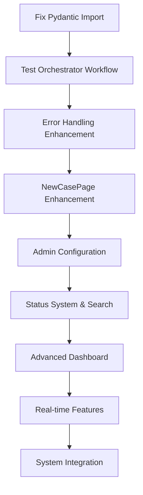

# DrFirst Business Case Generator - Unified Enhancement Roadmap

## 📋 Overview

This document consolidates all planned enhancements for the DrFirst Business Case Generator into a unified phased approach. It merges UX improvements, AI-powered features, system integrations, and infrastructure enhancements under a single timeline with consolidated success metrics.

**Last Updated:** December 21, 2024  
**Current Status:** Foundation Complete - AI Orchestrator Workflow Implemented  
**Team Assumption:** Single development team handling both frontend and backend work  
**Implementation Approach:** Phased rollout with clear dependencies and unified KPIs

---

## ✅ Recently Completed (December 2024)

### **COMPLETED: Multi-Page Business Case Navigation & AI Orchestrator Workflow**
- **Status:** ✅ COMPLETE
- **Description:** Fully implemented end-to-end AI agent workflow orchestration and multi-page navigation
- **Achievements:**
  - ✅ Created dedicated pages: `PRDPage.tsx`, `SystemDesignPage.tsx`, `ValueAnalysisPage.tsx`, `FinancialModelPage.tsx`
  - ✅ Implemented `ValueAnalysisSection.tsx` component with approval/rejection functionality
  - ✅ Enhanced `orchestrator_agent.py` with `handle_cost_completion()` method
  - ✅ Added financial estimates API routes with orchestrator integration
  - ✅ Complete orchestrated workflow: PRD → System Design → Effort Estimation → Cost Analysis → Value Analysis → Financial Model → Final Approval
- **Files Completed:**
  ```
  ✅ frontend/src/pages/case/PRDPage.tsx
  ✅ frontend/src/pages/case/SystemDesignPage.tsx  
  ✅ frontend/src/pages/case/ValueAnalysisPage.tsx
  ✅ frontend/src/pages/case/FinancialPage.tsx
  ✅ frontend/src/components/specific/ValueAnalysisSection.tsx
  ✅ backend/app/agents/orchestrator_agent.py (enhanced)
  ✅ backend/app/api/v1/cases/financial_estimates_routes.py (new)
  ✅ backend/app/api/v1/cases/models.py (enhanced)
  ```

---

## 🚨 Phase 0: Critical Technical Debt & Immediate Fixes (1-2 days)
*Priority: IMMEDIATE - System blocking issues*

### **0.1 Pydantic Import Error Fix (URGENT)**
- **Status:** 🔴 BLOCKING BACKEND STARTUP
- **Description:** Critical import error preventing backend server from starting
- **Error:** `ImportError: cannot import name 'model_schema' from 'pydantic.schema'`
- **Root Cause:** Pydantic version compatibility issue in `function_calling.py`
- **Files to fix:**
  - `backend/app/core/function_calling.py` (line 9)
  - `backend/requirements.txt` (potential version constraint)
- **Solution Options:**
  1. Update import to use Pydantic v2 syntax: `from pydantic._internal._model_serialization import to_jsonable_python`
  2. Pin Pydantic version in requirements.txt to compatible version
  3. Refactor function calling to use current Pydantic API
- **Estimate:** 2-4 hours
- **Priority:** IMMEDIATE

### **0.2 End-to-End Workflow Testing & Validation**
- **Description:** Test the complete orchestrator workflow after fixing backend issues
- **Components:**
  - Verify PRD approval triggers system design generation
  - Test cost analysis approval triggers value analysis
  - Validate value analysis approval triggers financial model
  - Confirm error handling and status updates work correctly
- **Test Cases:**
  - Happy path: Full workflow completion
  - Error scenarios: Agent failures, API timeouts
  - Edge cases: Multiple approvals, rejection handling
- **Files to verify:**
  - All orchestrator integration points
  - API endpoints functionality
  - Frontend state management
- **Estimate:** 4-6 hours

### **0.3 Error Handling & Logging Enhancement**
- **Description:** Add comprehensive error handling and logging to orchestrator workflow
- **Components:**
  - Enhanced error messages for agent failures
  - Structured logging for workflow progression
  - User-friendly error notifications in frontend
  - Retry logic for transient failures
- **Files to enhance:**
  ```
  backend/app/agents/orchestrator_agent.py
  backend/app/api/v1/cases/financial_estimates_routes.py
  backend/app/utils/logger.py (new)
  frontend/src/components/common/ErrorBoundary.tsx (enhance)
  ```
- **Estimate:** 6-8 hours

**Phase 0 Total Estimate:** 12-18 hours (1-2 days URGENT)

---

## 🎯 Next Immediate Steps (After Phase 0)

### **Quick Orchestrator Workflow Enhancements**
1. **Workflow Status Indicators:** Add real-time status updates in frontend when orchestrator progresses through stages
2. **Agent Progress Tracking:** Display current agent activity (e.g., "Generating System Design...", "Analyzing Costs...")
3. **Workflow Cancellation:** Allow users to cancel long-running orchestrator processes
4. **Notification System:** Email/in-app notifications when workflow stages complete
5. **Workflow History:** Track and display complete audit trail of orchestrator decisions

### **User Experience Polish**
1. **Loading States:** Proper loading spinners for all AI agent interactions
2. **Error Recovery:** User-friendly error messages with retry options
3. **Auto-save:** Prevent data loss during long-running processes
4. **Progress Persistence:** Resume workflows after browser refresh/logout

### **Performance Optimizations**
1. **API Response Caching:** Cache agent responses for faster subsequent loads
2. **Background Processing:** Move heavy AI operations to background tasks
3. **Partial Loading:** Load page sections incrementally rather than waiting for complete data

---

## 🎯 Phase 1: Critical Path & Quick Wins (2-3 weeks)
*Priority: Immediate user experience improvements and essential functionality gaps*

### 🚨 Critical Path Items (Task 10.1.x from Development Plan)

#### **1.1 NewCasePage Enhancement (HIGH PRIORITY)**
- **Description:** Fix critical UX gaps in the primary business case intake flow
- **Components:**
  - Enhanced user guidance with placeholder text and helper content
  - Improved form validation with inline error messaging  
  - Better post-submission flow (navigate to case detail instead of dashboard)
- **Files to modify:**
  - `frontend/src/pages/NewCasePage.tsx`
  - `frontend/src/services/agent/AgentService.ts` (validation helpers)
- **Estimate:** 8-10 hours
- **Success criteria:** Reduced user confusion, fewer form abandonment, immediate engagement with new cases

#### **1.2 Admin Configuration for Final Approvers (Task 9.1.4)**
- **Description:** Implement admin UI to designate global final approver role
- **Components:**
  - Firestore systemConfiguration collection
  - Admin UI for final approver management
  - Backend API integration
- **Files to modify:**
  - `frontend/src/pages/AdminPage.tsx`
  - `backend/app/api/v1/admin_routes.py`
  - `backend/app/models/system_config.py` (new)
- **Estimate:** 12-15 hours
- **Dependencies:** Phase 0 complete

### 🔍 Quick Wins - Search & Organization

#### **1.3 Status Visualization System**
- **Description:** Add colored status badges and progress indicators across the application
- **Components:**
  - StatusBadge component with color coding
  - Basic progress bar showing completion percentage
  - Status filter dropdown for dashboard
- **Files to create/modify:**
  ```
  frontend/src/components/common/StatusBadge.tsx (new)
  frontend/src/components/common/ProgressBar.tsx (new)
  frontend/src/components/common/StatusFilter.tsx (new)
  frontend/src/pages/DashboardPage.tsx
  ```
- **Status color mapping:**
  ```typescript
  const STATUS_COLORS = {
    INTAKE: 'info',
    PRD_DRAFTING: 'warning', 
    PRD_REVIEW: 'secondary',
    PRD_APPROVED: 'success',
    SYSTEM_DESIGN_DRAFTING: 'info',
    COST_ANALYSIS: 'primary',
    VALUE_ANALYSIS: 'primary', 
    FINANCIAL_MODEL: 'primary',
    APPROVED: 'success',
    REJECTED: 'error'
  }
  ```
- **Estimate:** 6-8 hours

#### **1.4 Basic Search & Filtering**
- **Description:** Client-side search and filtering for improved case discovery
- **Components:**
  - Search bar with real-time filtering
  - Status-based filtering
  - Sortable columns (date, status, title)
- **Files to create/modify:**
  ```
  frontend/src/components/common/SearchBar.tsx (new)
  frontend/src/components/specific/CasesList.tsx (new)
  frontend/src/pages/DashboardPage.tsx
  ```
- **Implementation:** JavaScript `filter()` and `sort()` methods for client-side performance
- **Estimate:** 8-10 hours

### 🎨 Navigation & Layout Improvements

#### **1.5 Enhanced Navigation & Breadcrumbs**
- **Description:** Improve application navigation and user orientation
- **Components:**
  - Enhanced AppLayout navigation with role-based links
  - Breadcrumb system for nested views
  - Clear page titles and context indicators
- **Files to modify:**
  - `frontend/src/layouts/AppLayout.tsx`
  - `frontend/src/components/common/Breadcrumbs.tsx` (new)
  - `frontend/src/pages/BusinessCaseDetailPage.tsx`
- **Estimate:** 6-8 hours

**Phase 1 Total Estimate:** 40-51 hours (1-2 weeks for single team)

---

## 🚀 Phase 2: Enhanced Features & AI Improvements (3-5 weeks)
*Priority: Advanced user features and intelligent system capabilities*

### 📊 Advanced Dashboard & Metrics

#### **2.1 Dashboard Metrics & Analytics**
- **Description:** Executive-level metrics dashboard with key performance indicators
- **Components:**
  - Metrics cards (total cases, pending reviews, approval rates)
  - Average time-to-approval tracking
  - Cost/value analysis summaries
  - User activity insights
- **Files to create:**
  ```
  frontend/src/components/specific/MetricsCard.tsx
  frontend/src/components/specific/DashboardMetrics.tsx
  backend/app/api/v1/analytics_routes.py
  backend/app/services/analytics_service.py
  ```
- **Backend integration:** New analytics endpoints with aggregation queries
- **Estimate:** 15-18 hours

#### **2.2 Multi-Step Progress Stepper**
- **Description:** Visual workflow progress with interactive navigation
- **Components:**
  - Interactive stepper component showing all workflow stages
  - Time estimates and current step highlighting
  - Clickable navigation to accessible stages
  - Blocked/at-risk indicators
- **Files to create:**
  ```
  frontend/src/components/common/ProgressStepper.tsx
  frontend/src/components/common/ProgressStep.tsx
  frontend/src/types/workflow.ts
  ```
- **Integration:** BusinessCaseDetailPage enhancement
- **Estimate:** 12-15 hours

### 🤖 AI-Powered System Enhancements

#### **2.3 Intelligent Effort Estimation**
- **Description:** AI-powered analysis for more accurate project estimates
- **Components:**
  - LLM-based PRD complexity analysis
  - Feature-based estimation with user story extraction
  - Technology stack impact assessment
  - Historical pattern recognition
- **Files to modify:**
  - `backend/app/agents/planner_agent.py`
  - `backend/app/utils/complexity_analyzer.py` (new)
- **AI Integration:** Enhanced Vertex AI prompts with structured analysis
- **Estimate:** 20-25 hours

#### **2.4 Dynamic Rate Card & Cost Modeling**
- **Description:** Advanced cost modeling with risk factors and scenarios
- **Components:**
  - Multi-rate card system with selection logic
  - Risk factor integration and contingency planning
  - Timeline-based cost variations
  - Resource availability constraints
- **Files to create/modify:**
  ```
  backend/app/services/rate_card_service.py (new)
  backend/app/utils/risk_calculator.py (new)
  frontend/src/components/specific/CostScenarios.tsx (new)
  ```
- **Estimate:** 18-22 hours

### 🎨 Enhanced User Interface

#### **2.5 ~~Multi-Page Business Case Navigation~~ ✅ COMPLETED**
- **Status:** ✅ COMPLETE (December 2024)
- **Description:** ~~Break complex business cases into dedicated focused pages~~
- **Achievement:** Successfully implemented with orchestrator workflow integration

#### **2.6 Enhanced Case Cards & Filtering**
- **Description:** Rich case presentation with advanced filtering capabilities
- **Components:**
  - Improved case card design with quick actions
  - Advanced filter panel with date ranges and multi-select
  - Saved search functionality
  - Pagination for large datasets
- **Files to create:**
  ```
  frontend/src/components/specific/CaseCard.tsx
  frontend/src/components/common/FilterPanel.tsx
  frontend/src/components/common/DateRangeFilter.tsx
  backend/app/api/v1/search_routes.py
  ```
- **Backend:** Saved searches collection in Firestore
- **Estimate:** 15-18 hours

**Phase 2 Total Estimate:** 90-103 hours (reduced from original due to completed work)

---

## 🌟 Phase 3: Advanced Features & System Integration (2-3 months)
*Priority: Enterprise-grade features and external system integration*

### ⚡ Real-time & Collaboration Features

#### **3.1 Real-time Updates & Notifications**
- **Description:** Live system updates and comprehensive notification system
- **Components:**
  - WebSocket/Server-Sent Events for real-time status updates
  - In-app notification center with @mentions
  - Email notification integration
  - Mobile-responsive notification UI
- **Files to create:**
  ```
  backend/app/services/websocket_service.py
  backend/app/services/notification_service.py
  frontend/src/services/websocket.ts
  frontend/src/components/common/NotificationCenter.tsx
  ```
- **Infrastructure:** WebSocket server setup and event management
- **Estimate:** 25-30 hours

#### **3.2 Enhanced Collaboration System**
- **Description:** Advanced collaboration tools for team workflows
- **Components:**
  - Comment system with reply threads
  - File attachment capabilities
  - Version control for PRDs and system designs
  - Activity feeds and change tracking
- **Files to create:**
  ```
  frontend/src/components/specific/CommentSection.tsx
  backend/app/api/v1/comment_routes.py
  backend/app/models/comment.py
  backend/app/services/version_control.py
  ```
- **Storage:** Enhanced Firestore collections for comments and versions
- **Estimate:** 30-35 hours

### 🔗 System Integration & Data Enhancement

#### **3.3 Project Management Integration**
- **Description:** Bi-directional integration with Jira and other PM tools
- **Components:**
  - Automatic project creation from approved business cases
  - Effort estimate conversion to project tasks
  - Progress tracking and variance reporting
  - Status synchronization between systems
- **Files to create:**
  ```
  backend/app/integrations/jira_service.py
  backend/app/integrations/confluence_service.py
  backend/app/services/project_sync.py
  ```
- **API Integration:** Secure connection to DrFirst Jira/Confluence instances
- **Estimate:** 35-40 hours

#### **3.4 Historical Data & Learning System**
- **Description:** Agent learning from historical project data
- **Components:**
  - Historical project database integration
  - Pattern recognition for similar projects
  - HITL feedback analysis and prompt refinement
  - RAG integration with approved case data
- **Files to create:**
  ```
  backend/app/services/learning_service.py
  backend/app/utils/pattern_matcher.py
  backend/app/agents/learning_agent.py
  ```
- **ML Infrastructure:** Advanced MLOps setup for continuous learning
- **Estimate:** 40-45 hours

### 📈 Advanced Analytics & Reporting

#### **3.5 Executive Analytics Dashboard**
- **Description:** Comprehensive analytics and business intelligence
- **Components:**
  - Case velocity and bottleneck identification
  - ROI trending and portfolio analysis
  - Resource allocation optimization
  - Success rate metrics and improvement tracking
- **Files to create:**
  ```
  frontend/src/pages/AnalyticsPage.tsx
  frontend/src/components/specific/Chart.tsx
  backend/app/services/advanced_analytics.py
  ```
- **Visualization:** Integration with Chart.js or similar charting library
- **Estimate:** 20-25 hours

#### **3.6 Export & Integration Enhancements**
- **Description:** Professional document generation and sharing
- **Components:**
  - Enhanced PDF export with company branding
  - PowerPoint presentation generation
  - Shareable links with access control (complete Task 9.3)
  - API integration for external consumption
- **Files to create/modify:**
  ```
  backend/app/utils/presentation_generator.py
  backend/app/api/v1/sharing_routes.py
  frontend/src/components/common/ShareDialog.tsx
  ```
- **Integration:** Office 365 API for PowerPoint generation
- **Estimate:** 18-22 hours

### 🔧 Technical Infrastructure & Performance

#### **3.7 Performance Optimization & Scaling**
- **Description:** System optimization for enterprise-scale deployment
- **Components:**
  - AI model caching and optimization
  - Database query optimization and indexing
  - Frontend performance improvements (lazy loading, virtualization)
  - Background processing for complex calculations
- **Files to modify:** Performance optimizations across entire codebase
- **Infrastructure:** Redis caching layer, job queue system
- **Estimate:** 25-30 hours

#### **3.8 Security & Compliance Enhancements**
- **Description:** Enterprise-grade security and audit capabilities
- **Components:**
  - API rate limiting and throttling
  - Comprehensive audit logging and compliance reporting
  - Enhanced security scanning and monitoring
  - Data privacy and GDPR compliance features
- **Files to create:**
  ```
  backend/app/security/rate_limiter.py
  backend/app/security/audit_logger.py
  backend/app/services/compliance_service.py
  ```
- **Estimate:** 20-25 hours

**Phase 3 Total Estimate:** 213-252 hours (6-8 weeks for single team)

---

## 📊 Consolidated Success Metrics & KPIs

### User Experience Metrics
- **Task Completion Time:** 30% reduction in time to create and navigate business cases
- **User Engagement:** 50% increase in daily active users and session duration
- **Feature Adoption:** 80% of users utilizing search/filter features within 30 days
- **Form Completion Rate:** 95% completion rate for NewCasePage (up from current baseline)
- **User Satisfaction:** 4.5/5 average rating in user feedback surveys

### System Performance Metrics
- **Page Load Time:** <2 seconds for dashboard, <3 seconds for business case detail pages
- **Search Response Time:** <200ms for client-side filtering, <500ms for server-side search
- **Real-time Update Latency:** <1 second for status changes and notifications
- **API Response Time:** 95th percentile <1 second for all endpoints
- **System Uptime:** 99.9% availability during business hours

### Business Impact Metrics
- **Estimation Accuracy:** 90% of estimates within 20% of actual costs (tracked over 6 months)
- **Approval Efficiency:** 75% reduction in business case preparation time
- **Decision Quality:** 95% of generated business cases approved on first submission
- **Process Automation:** 80% reduction in manual administrative tasks
- **ROI Tracking:** Positive ROI demonstrated within 3 months of case approval

### Technical Quality Metrics
- **Code Coverage:** >85% for all new features
- **Bug Density:** <1 critical bug per 1000 lines of code
- **Security Compliance:** 100% compliance with enterprise security standards
- **Performance Regression:** 0% performance degradation with new feature releases

---

## 🔄 Implementation Dependencies & Timeline

### Phase 0 Prerequisites
- ✅ Multi-page navigation complete
- ✅ Orchestrator workflow implemented
- 🔴 Pydantic import error blocking backend

### Phase 1 Prerequisites
- ✅ Phase 0 technical debt resolved
- ✅ Backend server running stable
- ✅ Orchestrator workflow tested end-to-end

### Phase 2 Prerequisites  
- Phase 1 search and navigation infrastructure
- Enhanced admin UI for configuration management
- Stable AI agent framework for enhancements

### Phase 3 Prerequisites
- Phase 2 advanced UI components and backend services
- Production-ready deployment infrastructure
- External system API access and credentials

### Critical Path Dependencies


---

## 🎯 Resource Allocation & Timeline

### Phase 0: Critical Technical Debt
- **Duration:** 1-2 days
- **Resources:** 1 full-stack developer
- **Priority:** IMMEDIATE - System blocking issues

### Phase 1: Critical Path & Quick Wins
- **Duration:** 2-3 weeks
- **Resources:** 1 full-stack developer
- **Priority:** Immediate deployment after Phase 0 completion

### Phase 2: Enhanced Features  
- **Duration:** 3-4 weeks (reduced from original)
- **Resources:** 1 full-stack developer + occasional design consultation
- **Priority:** Staged rollout with user feedback collection

### Phase 3: Advanced Features
- **Duration:** 6-8 weeks  
- **Resources:** 1 full-stack developer + DevOps support for infrastructure
- **Priority:** Enterprise feature rollout with pilot testing

### Total Timeline: 12-15 weeks (3-4 months including immediate fixes)

---

## 📝 Implementation Notes & Future Considerations

### Development Strategy
- **Incremental Delivery:** Each phase delivers functional value independently
- **User Feedback Integration:** Collect feedback after each phase for iteration
- **Feature Flags:** Use feature toggles for gradual rollout and A/B testing
- **Testing Strategy:** Comprehensive testing at each phase with automated regression testing

### Technology Considerations
- **Frontend:** Continue with React + TypeScript + Material-UI for consistency
- **Backend:** Leverage existing FastAPI + Firestore + Vertex AI infrastructure
- **Real-time:** WebSocket implementation with fallback to polling
- **Analytics:** Consider Google Analytics integration for user behavior tracking

### Risk Mitigation
- **API Rate Limits:** Implement caching and request optimization early
- **Data Privacy:** Ensure GDPR compliance for all new data collection
- **Performance:** Monitor system performance continuously during feature rollout
- **Security:** Regular security audits for new integrations and features

### Post-Implementation
- **Continuous Improvement:** Monthly feature usage analysis and optimization
- **User Training:** Create training materials and documentation for new features
- **Support Infrastructure:** Enhanced help system and user guidance
- **Scaling Preparation:** Monitor usage patterns for infrastructure scaling needs

---

*This unified roadmap consolidates all enhancement streams into a cohesive implementation strategy. Regular reviews and adjustments will ensure alignment with user needs and business objectives.* 